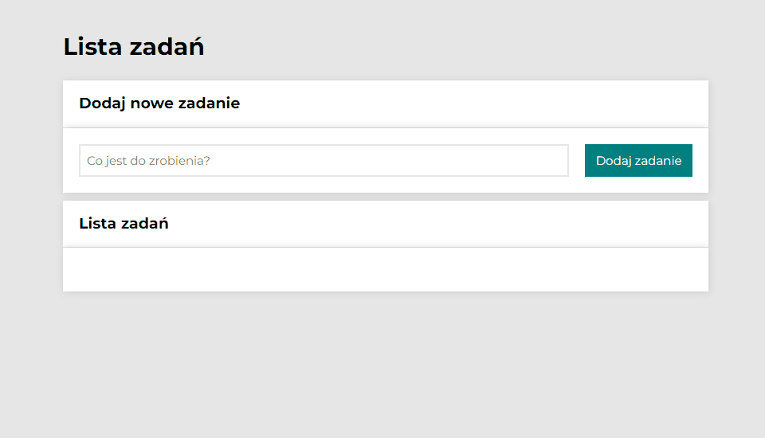

# Todo-list

## Demo

https://wroblewski82.github.io/todo-list/

## Description

The todo-list app is a simple but very practical project that was created for the youcode course. It was based on Vanilla JS. Includes ES6+ features: const, let, blocks, and arrow functions. I don't use more advanced solutions, instead when writing code I put special emphasis on the use of accepted conventions and good practices.

The correctness of my work is supervised by [Krzysztof Dąbrowski](https://www.linkedin.com/in/dabrowskisoftware) - an experienced Senior Software Engineer.

## Technologies

- Semantic HTML
- BEM
- CSS
- Grid
- Media queries
- ES6+ Features
- Immutability

## Instruction

Enter the task you want to add to the task list. Click the "Dodaj zadanie" button and you'll see it at the bottom of the app as the next item in the list.

If you want to select the task as done, click on the green icon. If you want to change your mind, click the green icon again.

You can use the "Ukryj/pokaż ukończone" button to hide or show completed tasks in the list, as well as the "Ukończ wszystkie" button to mark all tasks as completed.

If you want to delete your task, click on the red icon.
